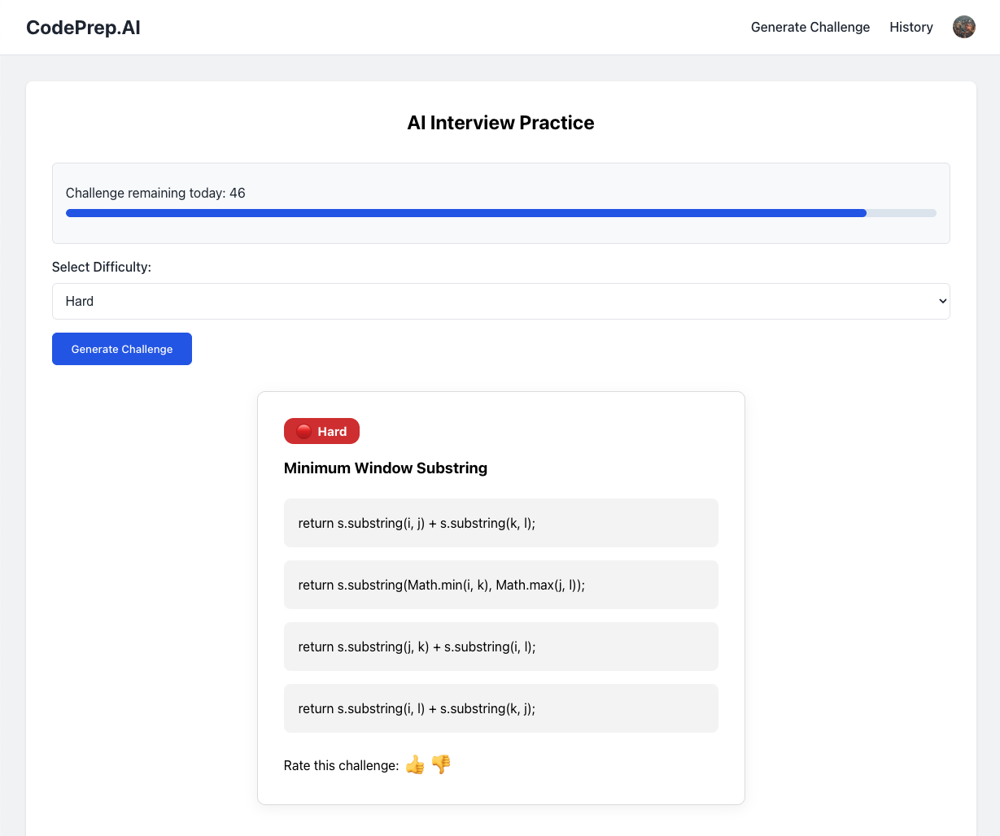

# CodePrep.AI

[](https://github.com/ethanvillalovoz/llm-coding-challenge-generator/actions)
[](LICENSE)
[](https://www.python.org/downloads/release/python-3130/)
[](https://react.dev/)

---

## 🚀 Introduction

**CodePrep.AI** is an AI-powered coding interview prep tool. Instantly generate coding challenges of varying difficulty, practice with real-time feedback, and track your progress—all in one place.

---

## 📖 Description

CodePrep.AI is a full-stack web application designed to help users prepare for coding interviews. It leverages the latest LLMs (Meta-Llama-3-8B-Instruct) to generate unique, multiple-choice coding challenges based on user-selected difficulty. Users can practice, review their challenge history, and manage their daily quota, all with a modern and intuitive UI.

---

## 🖼️ Visuals

> 
> 
> 

> *(Add your own screenshots or GIFs in the `docs/screenshots/` folder!)*

---

## 📦 Prerequisites

- **Python 3.13+** (for backend)
- [**Node.js 18+**](https://nodejs.org/en) (for frontend)
- [**Conda**](https://www.anaconda.com/download) (recommended for Python env management)
- [**Hugging Face account**](https://huggingface.co/) (for Llama model access)
- [**Clerk account**](https://clerk.com/billing?utm_source=rob-shocks&utm_medium=youtube&utm_campaign=billing-demo&dub_id=pzWcSsT9u95viwH6) (for authentication)
- [**Ngrok**](https://ngrok.com/) (for webhook testing)

---

## 🛠️ Technologies Used

- **Frontend:** React, React Router, Clerk, Custom CSS
- **Backend:** FastAPI, SQLAlchemy, Pydantic
- **AI/ML:** Hugging Face Transformers, Meta-Llama-3-8B-Instruct
- **Database:** SQLite
- **Authentication:** Clerk
- **Dev Tools:** Ngrok, Conda

---

## ⚡ QuickStart Guide

### 1. Clone the repository

```bash
git clone https://github.com/ethanvillalovoz/codeprep-ai.git
cd codeprep-ai
```

### 2. Backend Setup

```bash
conda create -n codeprep python=3.13
conda activate codeprep
pip install -r backend/requirements.txt
cd backend
huggingface-cli login
python server.py
```

### 3. Frontend Setup

```bash
cd frontend
npm install
npm run dev
```

### 4. Clerk & Ngrok

- [Sign up for Clerk](https://clerk.com/) and set up your API keys.
- [Install Ngrok](https://ngrok.com/) and run:
  ```bash
  ngrok http 8000
  ```

---

## ⚙️ Configuration

- **Environment Variables:**  
  You must create `.env` files for both the backend and frontend to securely store your API keys and configuration values.

  - **Backend:**  
    Create a file named `.env` in the `backend/src` directory with the following variables:
    ```
    # .env (backend)
    CLERK_API_KEY=your_clerk_secret_key
    JWT_KEY="your_jwt_secret"
    HUGGINGFACE_TOKEN=your_huggingface_token
    CLERK_WEBHOOK_SECRET=your_clerk_webhook_secret
    ```
    Replace the values with your actual secrets from Clerk and Hugging Face.

  - **Frontend:**  
    Create a file named `.env` in the `frontend/` directory with the following variable:
    ```
    # .env (frontend)
    VITE_CLERK_PUBLISHABLE_KEY=your_clerk_publishable_key
    ```
    Replace `your_clerk_publishable_key` with your Clerk publishable key.

  > **Tip:** Never commit your `.env` files to version control. Use `.env.example` to show required variables.

- **Model Selection:**  
  - Uses [Meta-Llama-3-8B-Instruct](https://huggingface.co/meta-llama/Meta-Llama-3-8B-Instruct) by default.
  - To use a different model, update the `model_id` in `backend/src/ai_generator.py`.

---

<!-- ## 🧪 Automated Tests

- (Add your test instructions here, e.g. `pytest` for backend, `npm test` for frontend)
- Example:
  ```bash
  cd backend
  pytest

  cd frontend
  npm test
  ```

--- -->

## 🗺️ Roadmap

- [x] AI-powered challenge generation
- [x] User authentication with Clerk
- [x] Challenge history and quota tracking
- [ ] Topic/tag-based challenge selection
- [ ] Timed/practice modes
- [ ] User feedback and challenge rating
- [ ] Leaderboard and streaks
- [ ] Mobile app version

---

## 🤝 Contribution

Contributions are welcome! Please see [CONTRIBUTING.md](CONTRIBUTING.md) for guidelines.

- Fork the repo and create your branch (`git checkout -b feature/your-feature`)
- Commit your changes (`git commit -am 'Add new feature'`)
- Push to the branch (`git push origin feature/your-feature`)
- Create a new Pull Request

---

## 📂 Folder Structure

```
llm-coding-challenge-generator/
│
├── backend/
│   ├── src/
│   │   ├── ai_generator.py
│   │   ├── app.py
│   │   ├── database/
│   │   ├── routes/
│   │   └── utils.py
│   └── requirements.txt
│
├── frontend/
│   ├── src/
│   │   ├── auth/
│   │   ├── challenge/
│   │   ├── history/
│   │   ├── layout/
│   │   └── utils/
│   ├── public/
│   ├── App.jsx
│   └── App.css
│
├── docs/
│   └── screenshots/
│
├── .env.example
├── README.md
└── LICENSE
```

---

## 📄 License

This project is licensed under the MIT License.

---

## 🙋 FAQ

**Q: Why use Llama 3?**  
A: Llama 3 provides high-quality, diverse coding challenges and is open for research and commercial use.

**Q: Can I use my own LLM?**  
A: Yes! Swap out the model in `ai_generator.py` for your preferred Hugging Face model.

**Q: How do I reset my quota?**  
A: Quotas reset automatically every 24 hours.

---

## 📊 Diagrams

> Example: Sequence diagram for challenge generation


---

*For more details, see the [Documentation](https://github.com/ethanvillalovoz/llm-coding-challenge-generator/docs).*